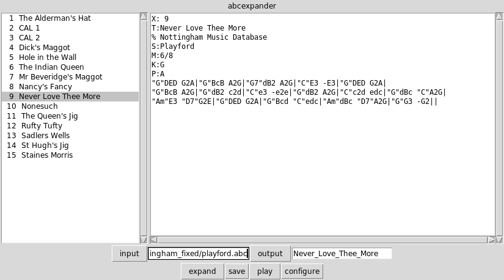
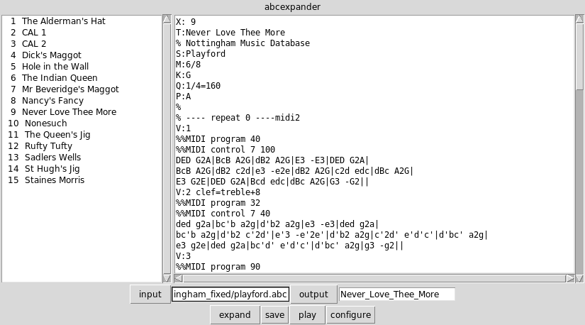
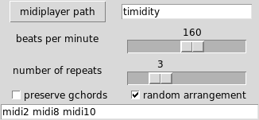
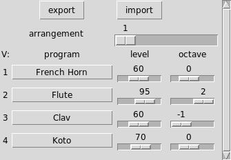

## Gchords to Voices

### Introduction

The program takes a plain single voiced abc tune and produces a 4 voiced
version of the tune where the embedded guitar chords have been expanded in the
last voice. The first three voices are copies of the tune without the guitar
chords but assigned to different instruments or midi programs. These voices
may be transposed up or down by an octave. The whole tune can be repeated
several times with different instrumental arrangements. The resulting tune can
be played immediately or saved in either abc or midi format.

Here are two midi files created with this program. [Morrison's
Jig](Morrisons_Jig.mid) and [Dick's Maggot](Dicks_Maggot.mid)  

### Requirements

The program requires the tcl/tk 8.5 or 8.6 interpreter in order to run. Tcl/tk
is usually available with Posix (Linux) systems and can installed for free on
Windows operating systems from
<https://www.activestate.com/products/tcl/downloads/>. If you wish to create a
midi file you will need abc2midi which is available from the abcMIDI package.
You will also need a midi player if you wish to test the midi file. If you are
able to hear the above sample midi files, then you already have a midi player
on your system.

The program also allows you to view and play the sheet music in common music
notation in a browser using the JavaScript code created by Jean-Francois
Moine. This does not require a midi player or abc2midi.

### Test Files

Any of the files in the [Nottingham
Database](https://ifdo.ca/~seymour/nottingham/nottingham.html) should work.  

### Usage

On Windows click on the g2v.tcl icon, on Linux or type

    
    
    wish g2v.tcl
    

If you are running the program for the first time, you may need to specify the
paths to the abc2midi executable, the midi player and your browser. Certain
defaults have been assumed for Windows and Linux operating systems. Go to
**configure/General configuration** at the bottom of the window and specify
the paths in either the entry boxes or navigate to the files using the
adjacent buttons. The configuration information will be stored in a file
g2v.ini when you exit the program.

Select an abc file using the **input** button at the bottom left to browse
your file. If the abc file contains a collection of tunes, select one of the
tunes in the table of contents list on the left.  
At this point, you can click on one of the bottom buttons, **play** ,
**display** , or **save**. The graphical user interface should look like this.  

You can click the **play** button any time to convert the exposed selection
into a midi file and to send the resulting midi file to to a midi player. You
can click the **display** button to show the common music notation in a
browser. (Clicking on a note in the browser will cause it to play and follow
the music.)

Clicking the **expand** button will convert this selection into a multivoiced
abc file with several repeats and display it on the scrollable and editable
text frame. 

You can save the resulting tune either as an abc file or a MIDI file by
clicking on the **save** menu button. By default the root name of the file is
determined from the title of the tune and the file is stored in the same
folder that g2v is stored. You can change the name by browsing the file
structure using the **output** button or editing the file path name in the
adjoining entry box.

The **output** button allows you to select any file for saving the above
contents. You do not need to indicate any extension since it will be added
automatically.

There are two configuration windows accessible from the **configure** menu
button that control how the tune is expanded. For some operating systems it is
likely that you will need to specify the midi player in the **general
configuration** window

It is assumed that abc2midi is in your execution path or is contained in the
same folder as g2v. The other controls are described in the **Advanced
Features** section of this documentation, but first you need to know how the
program works.

### Method

The tune is expanded into 4 voices. This is not configurable presently. Each
of the first three voices is a verbatim copy of the tune without the embedded
guitar chords, but the copy may be transposed up or down by one or two
octaves. The 4 th voice contains the bass/chordal accompaniment that would
automatically be generated by abc2midi from the the guitar chords embedded in
the body of the tunes. (Some control of the form of this accompaniment is
permitted using the **%%MIDI gchord** command. (See the [abc2midi guide
](http://ifdo.ca/~seymour/runabc/abcguide/abc2midi_guide.html) for an
explanation of these codes.) The expanded voices are a repeated a fixed number
of times so that the whole tune is played several times.

In each repeat the voices are assigned to specific MIDI programs (instrument)
and specific velocitys (loudness) by placing **%%MIDI program** and **%%MIDI
control** commands. The assignments are built into the program, however, they
can be changed using the configuration window described in the next section.
There are 11 possible instrument configuration which are addressed by the
labels **midi1, midi2,** and etc. In each repeat a different configuration is
chosen at random.

### Advanced Features

#### General Configuration

Many abc tunes do not typically include tempo indications. Since abc2midi by
default plays the tune at 120 beats/bar which is too slow for most dances, the
program inserts a tempo indication (eg. **Q: 1/4=180** ). You can change the
tempo, using the slider in the **general configuration** window to change the
desired tempo.  

By default the number of repeats is 3. The number can be increased or
decreased using the slider.

When you click on a specific tune in the left listbox, the program picks a
random selection of instrument configurations (midi2 midi8 midi10). You can
change this selection in the bottom entry box. If you remove the tick mark
from the check box labeled **random arrangement** the selection of instrument
configurations does not change each time you click on a new tune in the
listbox.

By default the guitar chords are all removed from the body of the tune before
making it a separate voice. If you wish to keep the guitar chords, put a tick
mark in the **preserve gchords** checkbox.

#### Configure Midi Arrangements

  
The program comes with a specific configuration of instruments for each of the
11 arrangements. The instruments, loudness and octave can be changed for any
voice and any arrangement using this window. Clicking **export** saves all
your changes in an tcl/tk formatted file g2varr.tcl. Clicking **import**
restores all the changes that you have saved. In addition, the file also
stores the path to your midiplayer.

* * *

This page was last updated on September 18 2020.

